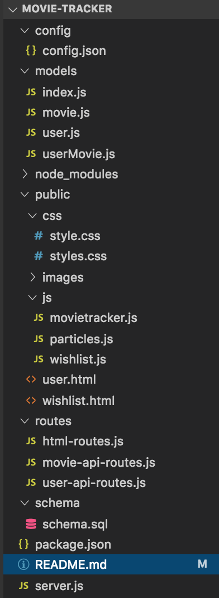

# Project-2: Movie Tracker


## Summary:
Movie Tracker keeps a record of movies individual users have added to their wishlist. It also tracks the movies they have watched, categorizing them into ‘liked’ and ‘disliked’ columns. Given the amount of movies out there, Movie Tracker provides an easy way for users to keep a record of movies they wish to see, and whether or not they liked the movies they have already seen. 

## Demo link:
https://sleepy-lowlands-10803.herokuapp.com/

## File Structure:


## Getting Started:
The simpliest way in seeing a demo of Movie-Tracker is to click on the Heroku demo link right above that leads it directly to the project without any installations required. This link can be found within this readme file or at the description area within http://github.com/duongsters/movie-tracker

To connect locally...
1) Clone Movie-Tracker repository via https://github.com/duongsters/movie-tracker
2) Run command line Terminal (or via Gitbash) 'npm install' for required NPMS used within the application...or just download all NPMs from Technologies Used below.
3) Run command line 'node server.js' to start up the application
4) Once connected to http://localhost:8080/ from CLI, copy that exact link to URL
5) Run 'ctrl + c' within the CLI to exit the application entirely


## Technologies Used:
- Javascript
- .JS: node.JS, particles.JS, express.JS, sequelize.JS
- CSS: animate.css
- jQuery
- NPM: Express, MySql, Sequelize, Path, body-parser, Heroku
- API: OMDB
- Bootstrap
- WebKit
- Iconify

## Code Snippets:
via wishlist.js:
* The 'displayMovieInfo' function runs initially by creating an AJAX call for the specific movie button being clicked...then iterates through response array to get movie ids with the for-loop. After, it will run the 'getMovieData' function to get the full movie info
```javascript
    function displayMovieInfo() {
        var movie = $("#movie-input").val();
        var queryURL = "https://www.omdbapi.com/?s=" + movie + "&y=&plot=short&apikey=9e558ee4";

        $.ajax({
            url: queryURL,
            method: "GET"
        }).then(function (response) {
            $(".container-movies").empty();
            for (var i = 0; i < response.Search.length; i++) {
                getMovieData(response.Search[i].imdbID);
            }
        });
    }
```
via wishlist.js:
* The 'getMovieData' function runs to get full movie info by searching for the movie id, the 'omdbID', the runs the 'createMovieElement' function to fill the page
```javascript
    function getMovieData(movieId) {
        var queryURL = "https://www.omdbapi.com/?i=" + movieId + "&y=&plot=short&apikey=9e558ee4"
        $.ajax({
            url: queryURL,
            method: "GET"
        }).then(function (response) {
            createMovieElement(response);
        })
    }
```

via wishlist.js:
* This important function, 'createMovieElement', will take all the needed information from OMDB's API server then dynamically generated the movie results within the wishlist.html webpage
```javascript
function createMovieElement(response) {
    var resultsFront = $("<div class='movie-inside front'>");
    var resultsBack = $("<div class='movie-inside back'>");
    var movieDetails = $("<div class='movie-details'>");
    var movieBox = $("<div class='movie'>");
    var movieContainer = $("<div class='container-movie'>");


    var addToWishlist = $("<button class='addToWishlist' type='button'>Add to Wishlist</button>");
    addToWishlist.data("id", response.imdbID);

    var poster = response.Poster;
    var posterInput = $("").attr("src", poster);
    resultsFront.append(posterInput);

    var title = response.Title;
    var titleInput = $("<h1 class='movie-title'>").text(title);
    movieDetails.append(titleInput);


    var year = response.Year;
    var yearInput = $("<span>").text("Released: " + year);
    movieDetails.append(yearInput);


    var runtime = response.Runtime;
    var runtimeInput = $("<span>").text(" Runtime: " + runtime);
    movieDetails.append(runtimeInput);


    var plot = response.Plot;
    var plotInput = $("<p class='movie-plot'>").text("Plot: " + plot);
    movieDetails.append(plotInput);


    movieBox.append(resultsFront);
    resultsBack.append(movieDetails);
    movieBox.append(resultsBack);


    resultsBack.append(addToWishlist);

    movieContainer.append(movieBox);

    $(".container-movies").append(movieContainer);
}
```

## Author Links:
[GitHub](https://github.com/duongsters)
[LinkIn](https://www.linkedin.com/in/theandrewduong/)
[Updated-Portfolio] (https://duongsters.github.io/updated-portfolio/)
